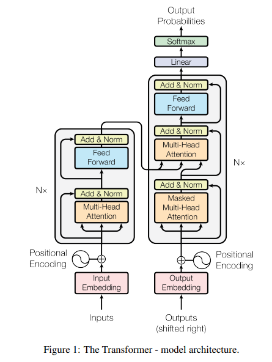
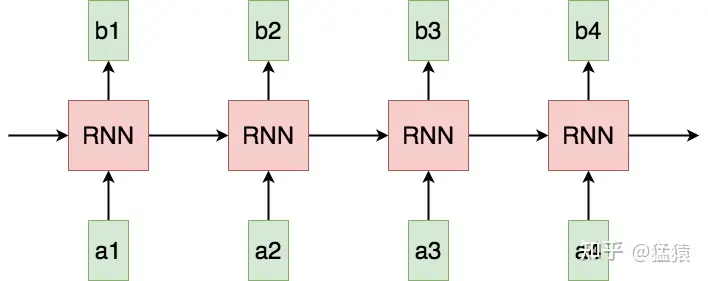

# transformer

本内容参考：
1. [知乎：Transformer学习笔记一：postional_encoding](https://zhuanlan.zhihu.com/p/454482273)
2. [知乎：一文读懂transformer模型的位置编码](https://zhuanlan.zhihu.com/p/106644634)



## 一、为什么出现

## 二、主要组成模块
```
encoder-decoder架构
embedding层
positional-encoding位置编码
self-attention层/multi-head attention(多头注意力层)
fully-connected network全连接层
```

## 三、positional-encoding位置编码
  
### 为什么需要位置编码？

1.单词在位置中排列及位置顺序，不仅表示是语法结构的组成，而且表达语义。  
2.Transformer摒弃rnn、cnn的架构。rnn架构顺序结构的，天生可以包含语言的位置信息。采用attention会无法知道每个词在句子中的位置和顺序。所以需要**把词序信息加入到词向量**中。

### 什么是位置编码？
位置编码，用词在序列中的位置顺序信息对词进行二次表示的方法。
在transformer的encoder和decoder的输入层中，使用了位置编码positional encoding，使得最终的输入:  
$\textcolor{red}{input = input_embedding + positional_encoding}$  
**input_embedding**是常规embedding层得到的，将每一个token的向量维度从vocab_size映射到d_model
**prostional_encoding**的维度和input_embedding一致

### 位置编码如何实现？(位置编码的演变历程) 

1. *整型值标记位置*  
第一个token标1，第二个token标2...
```
导致的问题：
(1)模型使用时可能遇到比训练时最长的序列更长的序列，不利于模型泛化。  
(2)模型的位置表示无界，会随着序列长度增加，位置值会无限增大。
```
2. *用[0,1]范围标记*  
为避免整型值的问题，可将位置值限制在[0,1]，0表示第一个，1表示最后一个。  
导致的问题，在序列长度不等时，token间的相对距离不一样。
因此，好的位置编码应满足：
```
(1)能用来表示一个token在序列中独一无二的编码
(2)不同长度的句子之间，不同序列中token的相对位置/距离也要一致
(3)模型应该能毫不费力地泛化到更长的句子。它的值应该是有界的(可以表示模型在训练时从未看到过的句子长度)
```

3. *用二进制向量标记位置*  
考虑到位置信息要作用到embedding上，因此用和input_embedding维度一样的向量表示位置比用单一值更好。此时，可以想到二进制编码：
若d_model=3，即input_embedding的维度是3，那么可以表示0-7这个8个位置的序列，但一般实际transformer中d_model的维度很大，可以满足序列长度的要求。
```
导致的问题：
(1)位置向量处在离散空间中，不同位置间变化不连续
(2)相邻位置间相对距离也不相等
```
4. *用周期函数sin来表示位置*  
考虑把位置向量中的每一个元素都用sin函数来表示，则第t个token的位置向量可以表示为：
$ PE_t = [sin(\frac{1}{2^0}t, sin(\frac{1}{2^1}t)...,sin(\frac{1}{2^{i-1}}t),...,sin(\frac{1}{2^{d_{model}-1}}t)]$
```python
from matplotlib import pyplot as plt
import numpy as np
import math

def getlist(x):
    for i in range(0, x, 1):
        yield i/10.0
x = lambda t: math.sin(t)
y = lambda t: math.sin(t/2)
z = lambda t: math.sin(t/3)
o = list(getlist(165))

xdata = list(map(x, o))
ydata = list(map(y, o))
zdata = list(map(z, o))

ax = plt.axes(projection='3d')
ax.scatter(xdata, ydata, zdata, c=zdata, cmap='viridis', linewidth=0.5)

ax.set_xlabel('X:sin((1/2^0)*t)')
ax.set_ylabel('Y:sin((1/2^1)*t)')
ax.set_zlabel('Z:sin((1/2^2)*t)')
plt.show()
```

.png)
```python
import math
from functools import reduce
def get_distance(point1, point2):
    if len(point1) != len(point2):
        return None
    else:
        sums = 0
        for i in range(len(point1)):
            sums += (point1[i] - point2[i])**2
        return math.sqrt(sums)

datas = list(zip(xdata, ydata, zdata))
print(get_distance(datas[0], datas[1]))
print(get_distance(datas[1], datas[2]))
print(get_distance(datas[2], datas[3]))
print(get_distance(datas[3], datas[4]))
```
.png)
```
导致的问题：
(1)sin是周期函数，因此函数频率越大，则波长偏短，如上图所示，则有可能出现不同t下的位置向量出现重合的情况。
(2)也不能完全做到相邻两点之间的距离相等。
```
为了避免上述情况出现，$\textcolor{red}{会将函数波长拉长，把所有频率都设置为非常小的值}$。transformer论文中采用$\frac{1}{10000^{\frac{i}{d_{model}-1}}}$这个频率（i不表示第i个位置）。
conclusion:
$PE_t=[sin(w_0t),sin(w_1t),...,sin(w_{i-1}t),...,sin(w_{d_{model}-1}t))]$,
其中
$w_i=\frac{1}{10000^{\frac{1}{d_{model}-1}}}$

5. *用sin和cos交替表示*  
4中用sin函数作为位置编码，且选择较小的频率，使得不会出现有不同的位置t下出现相同的位置编码。基于此，位置向量实现了(1)每个token的向量唯一；(2)位置向量有界，且在连续空间。现在还希望**不同位置向量可以通过线性转换得到**，即：  
$PE_{t+\Delta t}=T_{\Delta t}*PE_t$  
其中T表示线性变换矩阵，  
$$\begin{pmatrix}sin(t+\Delta t) \\ cos(t+\Delta t) \end{pmatrix} = \begin{pmatrix} cos\Delta t & sin\Delta t \\ -sin\Delta t & cos\Delta t\end{pmatrix} \begin{pmatrix} sint \\ cost \end{pmatrix}$$
基于以上，可以将原来sin函数的$PE_t$做一个替换，让位置两两一组，分别用sin和cos的函数对来表示，可以$PE_t$表示成：
$PE_t=[sin(w_0t), cos(w_0t), sin(w_1t), cos(w_1t), ..., sin(w_{\frac{d_{model}}{2}-1}t), cos(w_{\frac{d_{model}}{2}-1}t)]$


可以用线性变化把$PE_t$转变成$PE_{t+\Delta t}$.

## 四、Transformer中位置编码方法：Sinusoidal functions
Transformer位置编码的重要性质

(1)性质一：两个位置编码的点积，仅取决于偏移量$\Delta t$,也即两个位置编码的点积可以反应出两个位置编码间的距离。  
(2)性质二：位置编码的点积是无向的，即$PE^T_{t}*PE_{t+\Delta t} = PE^T_{t} * PE_{t-\Delta t}$


## 五、self-attention注意力机制


RNN存在的问题：
**(1)Sequential operations的复杂度随着序列长度增加而增加**
**(2)Maximum Path length的复杂度随着序列长度的增加而增加**
<script type="text/javascript" src="http://cdn.mathjax.org/mathjax/latest/MathJax.js?config=TeX-AMS-MML_HTMLorMML"></script>
<script type="text/x-mathjax-config">
  MathJax.Hub.Config({ tex2jax: {inlineMath: [['$', '$']]}, messageStyle: "none" });
</script>