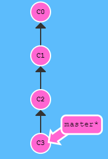
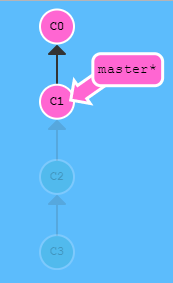
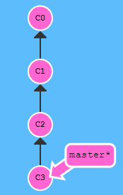
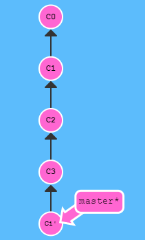

### git

#### git本地操作

##### 1.git commit

初始状态本地只有一个分支master，当前master分支指向C1提交


```git
git add .
git commit -m 'C2'
```


master分支指向最新一次提交C2

##### 2.git branch

初始状态


```
git branch hello
```


```
git checkout hello
```


**git checkout -b hello** 操作等价于

先执行**git branch hello** 再执行**git checkout hello**

此时在做**git add**和**git commit**操作的话，会在新的**hello**分支上进行提交，如下


##### 3.分支合并(git merge)

初始状态，有两个分支，master和hello，两个分支的当前版本都是基于版本C1做出改变的版本


此时先将，hello分支合入master分支

```
git merge hello
```


将master分支合入hello分支

```
git checkout hello
git merge master
```


##### 4.分支合并(git rebase)

rebase其实是取出一系列的记录，复制之后，在其他地方逐个放下

rebase比起merge的好处，可以 使得提交历史更下线性清晰

此时初始状态，


```
git rebase master
```


此时复制hello分支的记录C2到master的C3记录之后，

让master也指向最新一次提交记录，只需在master分支下执行rebase操作，如

```
git checkout master
git rebase hello
```


##### 5.HEAD分离

HEAD是对当前记录的符号引用，指向你正在其基础上进行工作的提交记录。在HEAD和分支未分离的情况下，HEAD总是指向当前分支的最新一次提交。

初始状态，当前HEAD指向分支master


可以通过操作

```
git checout bugFix
```

使得，HEAD指向分支bugFix**(指向分支时，分支标记*)**，


也可以，直接选定版本串号(版本hash值)，使得HEAD直接指向记录

```
git checkout C4
```


此时HEAD和分支处于分离的状态

##### 6.相对引用^和~

^表示向上移动一个提交记录

~num表示向上移动多个提交记录

##### 7.撤销变更(git reset)

git reset操作 通过把分支回退几个提交记录来实现撤销，就好像记录从来没有提交过。

初始状态，master分支指向最新一次提交C3



```
git reset HEAD~2
或
git reset master~2
```

 此时，会回退两个版本



C2 和 C3就好像没有提交过一样

##### 8.撤销变更(git revert)

git reset 回退版本无法推到远端仓库，git revert后会在提交树上之后新增提交，但新一次提交的结果和上上次版本一致

初始状态



```
git revert HEAD~2
```



执行完后，会在提交树上直接新增一次提交，而该次提交和回退的提交完全一致

